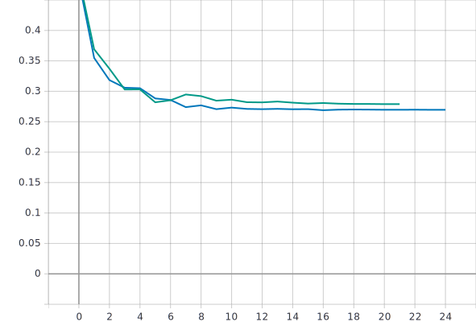
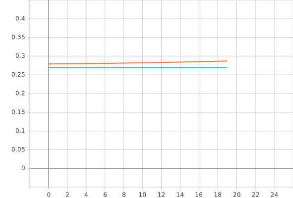

Лабораторная работа #5.
===
Решение задачи классификации изображений из набора данных Oregon Wildlife с использованием нейронных сетей глубокого обучения и техники обучения Fine Tuning.
---

1)С использованием техники обучения Transfer Learning, оптимальной политики изменения темпа обучения, аугментации данных с оптимальными настройками обучить нейронную сеть EfficientNet-B0 (предварительно обученную на базе изображений imagenet) для решения задачи классификации изображений Oregon WildLife.
---

Для решения данной задачи были использованы следующие техники аугментации данных с оптимальными параметрами: 
* Для яркости/контраста оптимальные параметры - `contrast_factor = 2, delta = 0.1;` (`delta` - величина для добавления к значениям пикселей, `contrast_factor` - множитель для регулировки контрастности).
* Для случайного вращения оптимальные параметры - `factor = (0, 0.025);`(`factor` - величина представляющая собой верхнюю и нижнюю границу для вращения изображения как по часовой стрелке так и против).
* Для добавления случайного шума оптимальные параметры - `stddev = 0.05;`(`stddev` - значение среднеквадратичного отклонения добавляемого шума).
* Для использования случайной части изображения оптимальные параметры - `resizing(235,235) RandomCrop(224,224);` (`height` и `width` - высота и ширина соответственно).

В качестве оптимальной политики изменения темпа обучения была принята политика exp_decay с параметрами:
* `initial_lrate = 0.01` - начальный темп обучения, `k = 0.3` - коэффициент наклона экспоненциальной кривой.

Изменения в коде:
```
example['image'] = tf.image.resize(example['image'], tf.constant([235, 235])) #входное изображение 235х235
```
```
def contrast(image, label):
  return tf.image.adjust_contrast(image, 2.0), label


def brightness(image, label):
  return tf.image.adjust_brightness(image, delta=0.1), label
  
return tf.data.TFRecordDataset(filenames)\
    .map(parse_proto_example, num_parallel_calls=tf.data.AUTOTUNE)\
    .cache()\
    .map(brightness)\
    .map(contrast)\
    .batch(batch_size)\
    .prefetch(tf.data.AUTOTUNE)
```
```
def exp_decay(epoch,lr):
  initial_lrate = 0.01
  k = 0.3
  lrate = initial_lrate * math.exp(-k*epoch)
  return lrate
```

```
def build_model():
  inputs = tf.keras.Input(shape=(235, 235, 3))
  x = tf.keras.layers.GaussianNoise(stddev = 0.05)(inputs)
  x = tf.keras.layers.experimental.preprocessing.RandomCrop(224,224)(x)
  x = tf.keras.layers.experimental.preprocessing.RandomRotation(factor = 0.025)(x)
  model = EfficientNetB0(input_tensor = x, include_top=False, pooling = 'avg', weights='imagenet')
  model.trainable = False
  x = tf.keras.layers.Flatten()(model.output)
  outputs = tf.keras.layers.Dense(NUM_CLASSES, activation = tf.keras.activations.softmax)(x)
  return tf.keras.Model(inputs=inputs, outputs=outputs)
```

График обучения для нейронной сети EfficientNetB0(предварительно обученной на базе изображений imagenet) с использованием оптимальной политики изменения темпа обучения и аугментации данных с оптимальными настройками.
---

***Линейная диаграмма точности:***


***Линейная диаграмма потерь:*** 
 

 
 
 
***Анализ результатов:*** 
Исходя из графиков видно, что:
* Сходится на 20 эпохе;
* Метрика точности, на валидационном наборе данных, в конце обучения = ***89.25%***
* Потери, на валидационном наборе данных, в конце обучения = ***0.277***

2)С использованием техники обучения Fine Tuning дополнительно обучить нейронную сеть EfficientNet-B0 предварительно обученную в пункте 1.
---

Для использования техники обучения Fine Tuning, требуется:
* Первый шаг - заморозить все слои, кроме верхних и обучить сеть. Для этого шага использовалась оптимальная политика изменения темпа обучения exp_decay с параметрами (`initial_lrate = 0.01` - начальный темп обучения, `k = 0.3` - коэффициент наклона экспоненциальной кривой).

```
model.trainable = False
```
* Второй шаг - разморозить все слои, кроме `BatchNormalization` и дообучить с меньшим темпом обучения.

Для разморозки всех слоев, кроме BatchNormalization, использовалась функция:
```
def unfreeze_model(model):
    for layer in model.layers:
        if not isinstance(layer, tf.keras.layers.BatchNormalization):
            layer.trainable = True
```

После цикла обучения с использованием техники Transfer Learning дополнительно реализуется цикл обучения с использованием техники Fine Tuning.
```
unfreeze_model(model)
     
  model.compile(
    optimizer=tf.optimizers.Adam(lr=2e-8),
    loss=tf.keras.losses.categorical_crossentropy,
    metrics=[tf.keras.metrics.categorical_accuracy],
  )
  model.fit(
    train_dataset,
    epochs=20,
    validation_data=validation_dataset,
    callbacks=[
      tf.keras.callbacks.TensorBoard(log_dir),
    ]
  )
```
График обучения для нейронной сети EfficientNetB0(предварительно обученной на базе изображений imagenet) дополнительно обученную с использованием техники Fine Tuning, предварительно обученную с использованием оптимальной политики изменения темпа обучения и аугментации данных с оптимальными настройками.
---
***Линейная диаграмма точности, до разморозки слоев:***


***Линейная диаграмма потерь, до разморозки слоев:*** 


 
 
 
 ***Линейная диаграмма точности, после разморозки слоев:***


***Линейная диаграмма потерь, после разморозки слоев:*** 




***Анализ результатов:*** 


